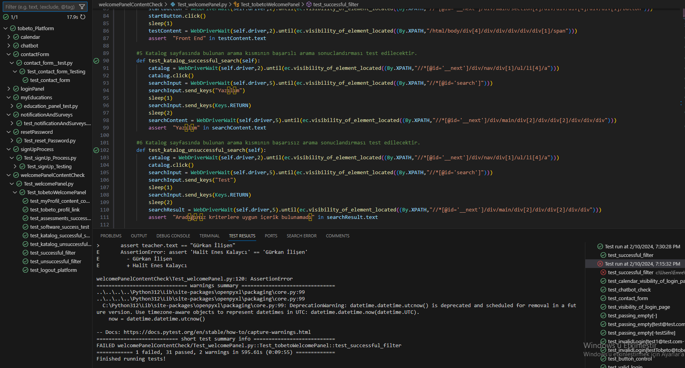
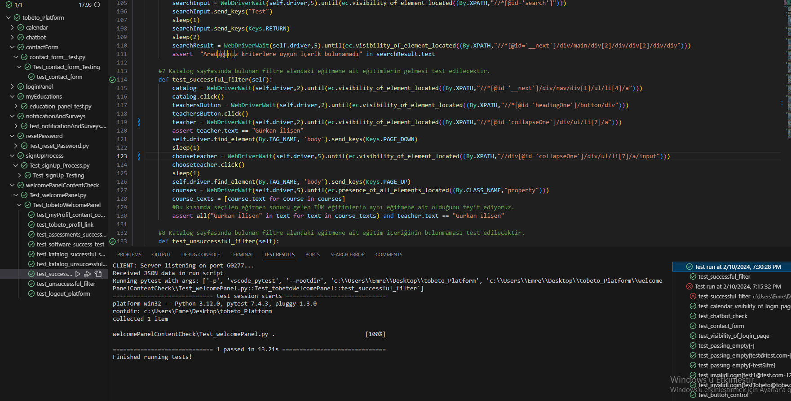

<h1>TOBETO PLATFORM TEST OTOMASYONU</h1>
<table>
  <ul><h3>Data</h3>
    <li>Otomasyon içerisinde veri girişi yapılan bazı yerler buradaki data klasörü içerisinde gelmektedir.</li>
    <li>Bu otomasyonda datalar excel dokümanı üzerinden gelmektedir.</li>
  </ul>
  <ul><h3>Constants</h3>
    <li>Otomasyon içerisinde sıklıkla tekrar eden locatorlar bu kısımda yer almaktadır.</li>
  </ul>
  <ul><h3>Test Senaryoları</h3>
    <li>Giriş yap</li>
    <li>Kayıt ol</li>
    <li>Şifremi unuttum</li>
    <li>Chatbot</li>
    <li>Takvim</li>
    <li>Duyuru Haberlerim ve Anketlerim</li>
    <li>Eğitimlerim</li>
    <li>Hosgeldin Paneli İçerik Kontrolü</li>
    <li>İletişim Formu</li>
  </ul>
  <ul><h3>Not: Bazı Test Senaryoları İçin Gerekli Ön Koşullar</h3>
    <li>Platforma Kayıtlı Bir Hesap Olmalı</li>
    <li>İstanbul Kodluyor Eğitim Programına Dahil Olmalı</li>
    <li>Eğitimleri Atanmış Olmalı</li>    
  </ul>
  <ul><h3>Methods</h3>
    <li>setup_method: Her testin başında çalıştırılması istenilen komutlar burada yer almaktadır.</li>
    <li>teardown_method: Her test bitiminde otomasyonun yapmasını istediğimiz komutlar burada yer almaktadır.</li> 
    <b>Not:</b> Veri tekrarlarını en aza indirmek için bu methodları kullanıyoruz. Bazı test senaryolarında fonksiyonlar oluşturarak setup methodu içerisinde çağırdık. Örnekler için Senaryolara göz atabilirsiniz.
  </ul>
  <ul>
    <h3>PYTEST SONUÇLARI</h3>
      
    <li>Katalog sayfasındaki eğitmenler kısmında xpathler sayfa içinde ara ara değişmektedir. Bu sebeple tüm testleri çalıştırdığımızda başarılı filtreleme test case'inde bir failed aldık.</li> 
      
    <li>Sayfa içerisinden yeni bir Xpath alındığında failed aldığımız case'in başarılı bir şekilde passed olduğunu görmektesiniz.</li>
  </ul>
</table>
