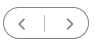
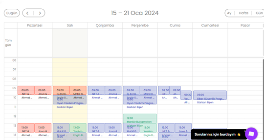

<h1>TEST SENERYOSU 6 TAKVİM KISMININ KONTROLÜ</h1>
<b>Açıklama :</b> “Takvim” sayfası , “Eğitim arama”,”Eğitmen”,”Eğitim Durumu”,başlıklarına sahip eğitim filtreleri alanından , “Bugün” butonu ,yön butonları ,
“Ay”, “Hafta”,”Gün” filtreleme butonlarına sahip zaman filtreleri alanından ve bu zaman filtrelerine göre değişen başlıkların kontrol edilecektir. 
<b>Ön koşullar :</b> Test ortamı çalışır ve hazır durumda olmalıdır. “https://tobeto.com/platform’’ sayfası erişilebilir olmalıdır.  

<h4>Test Case 1: Takvimine  Butonuna Erişim</h4>
<b>Açıklama:</b> sayfanın üst kısmındaki takvim butonuna tıklayarak “Takvim" sayfasına erişebilmesi ve sayfanın açılması test edilecektir. 
<b>Ön koşul:</b> ‘’ https://tobeto.com/takvim ’’ sayfası erişilebilir olmalıdır.  
<b>Adımlar:</b> 
<b>1-</b> Call test(test senaryosu1/ test case1) 
<b>2-</b>Takvim butonunu tıkla  
   
<b>Beklenen Sonuç:</b> Takvim butonuna tıklanıldığında aşağıdaki sayfa açılmalıdır.  
   
<h4>Test Case 2: “Eğitim Arama “butonun  test edilmesi</h4>
<b>Açıklama:</b> “Eğitim arama” filtresinden “eğitimi arayın “başlığının  doldurulması ve eğitime uygun tarih ve saat gösterilmesi test edilecektir. 
<b>Ön koşul:</b> ’ https://tobeto.com/takvim ’’ sayfası erişilebilir olmalıdır. Takvim  penceresi açılabilir olmalıdır.  
<b>Adımlar:</b> 
<b>1-</b> Call test(test senaryosu1/ test case1) 
<b>2-</b>Takvim butonunu tıkla 
<b>3-</b>“Eğitim arama” butonunu göster 
   
<b>4-</b>input gir:test  
   
<b>Beklenen sonuç:</b> Girilen değere göre başarılı bir şekilde filtrelenmelidir.Takvim ve saat görüntülenmelidir.  
   

<h4>Test Case 3: “Bugün“ butonun kontrol edilmesi</h4>
<b>Açıklama:</b> ‘Bugün’ butonuna tıklandığında takvim üzerinde, güncel günü belirtmesi test edilecektir. 
<b>Ön koşul:</b> ’ https://tobeto.com/takvim ’’ sayfası erişilebilir olmalıdır. Takvim  penceresi açılabilir olmalıdır.  
<b>Adımlar:</b> 
<b>1-</b> Call test(test senaryosu1/ test case1) 
<b>2-</b>Call test(takvim test senaryosu1/test case1)  
<b>Beklenen Sonuç:</b>Görseldeki gibi olmalıdır.  
   
<h4>Test Case 4: “Yön“ butonun kontrol edilmesi</h4>
<b>Açıklama:</b>  yön oklarını kullanarak gelecek ve geçmiş eğitim takvimini görüntülenmesi test edilecektir. 
<b>Ön koşul:</b> ’ https://tobeto.com/takvim ’’ sayfası erişilebilir olmalıdır. Takvim  penceresi açılabilir olmalıdır.  
<b>Adımlar:</b> 
<b>1-</b> Call test(test senaryosu1/ test case1) 
<b>2-</b>Call test(takvim test senaryosu1/test case1) 
<b>3-</b>Yön okları tıkla  
   
<b>Beklenen Sonuç:</b>  yön oklarını kullanarak gelecek ve geçmiş eğitim takvimini görüntüleyebilmelidir.  
   
  
 
<h4>Test Case 5: “Ay“ butonun kontrol edilmesi</h4>
<b>Açıklama:</b> ‘Ay’ butonuna tıklandığında takvim üzerinde, güncel “ay”belirtmesi test edilecektir. 
<b>Ön koşul:</b> ’ https://tobeto.com/takvim ’’ sayfası erişilebilir olmalıdır. Takvim  penceresi açılabilir olmalıdır.  
<b>Adımlar:</b> 
<b>1-</b> Call test(test senaryosu1/ test case1) 
<b>2-</b>Call test(takvim test senaryosu1/test case1) 
<b>3-</b>Ay butonuna tıkla  
   
<b>Beklenen Sonuç:</b>Ay butonuna tıklanıldığında takvim görseldeki gibi olur.  
   

<h4>Test Case 6: “Hafta“ butonun kontrol edilmesi</h4>
<b>Açıklama:</b> ‘Gün’ butonuna tıklandığında takvim üzerinde, güncel “hafta”belirtmesi test edilecektir. 
<b>Ön koşul:</b> ’ https://tobeto.com/takvim ’’ sayfası erişilebilir olmalıdır. Takvim  penceresi açılabilir olmalıdır.  
<b>Adımlar:</b> 
<b>1- </b>Call test(test senaryosu1/ test case1) 
<b>2-</b>Call test(takvim test senaryosu1/test case1) 
<b>3-</b>Hafta butonuna tıkla  
   
<b>Beklenen Sonuç: </b>Hafta butonuna tıklanıldığında takvim görseldeki gibi olur.  
   
<h4>Test Case 7: “Gün“ butonun kontrol edilmesi</h4>
<b>Açıklama:</b> ‘Gün’ butonuna tıklandığında takvim üzerinde, güncel “gün”belirtmesi test edilecektir. 
<b>Ön koşul:</b> ’ https://tobeto.com/takvim ’’ sayfası erişilebilir olmalıdır. Takvim  penceresi açılabilir olmalıdır.  
<b>Adımlar:</b> 
<b>1-</b> Call test(test senaryosu1/ test case1) 
<b>2-</b>Call test(takvim test senaryosu1/test case1) 
<b>3-</b>Gün butonuna tıkla  
   
<b>Beklenen Sonuç:</b>Gün butonuna tıklanıldığında takvim görseldeki gibi olur. 
  
 

