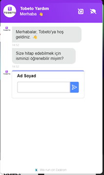

<h1>TEST SENERYOSU 5 :CHATBOT</h1>
<b>Açıklama :</b>  Ana sayfa üzerinde  sağ alt kısımdaki "Chatbot" kısmına tıkladığında chatbot beklenildiği gibi çalışmalıdır. 
<b>Ön koşul :</b> ‘’https://tobeto.com’’ url adresinin erişilebilir olması gerekmektedir.  

<h4>Test Case 1 : Chatbot kontrolü</h4>
<b>Açıklama :</b> Kullanıcı sayfanın sağ alt kısmındaki "Chatbot" kısmına tıkladığında chatbotun görüntülenmesi test edilecektir. 
<b>Ön koşul :</b> ‘’https://tobeto.com’’ url adresinin erişilebilir olması gerekmektedir.  
<b>Adımlar:</b> 
<b>1-</b>‘’https://tobeto.com’’ url sayfasına git. 
<b>2-</b> Sayfanın sağ alt kısmındaki "Chatbot" simgesine tıkla. 
<b>3-</b>Chatbot sayfasının açıldığını kontrol et.  
<b>Beklenen Sonuç :</b> "Chatbot" açılıp sayfanın sağ alt kısmında görüntülenebilir olmalıdır. 
                                                             
<h4>Test Case 2 : Mesaj Gönderim Bölümü Kontrolü</h4>
<b>Açıklama:</b> Kullanıcının Ad Soyad kısmında metin girişi yapabilmesi ve hazır mesajla yönlendirilmesi  kontrol edilecektir.  
<b>Adımlar:</b> 
<b>1-</b>‘’https://tobeto.com’’ url sayfasına git. 
<b>2-</b> Sayfanın sağ alt kısmındaki "Chatbot" simgesine tıkla. 
<b>3-</b>Chatbot sayfasının açıldığını kontrol et. 
<b>4-</b>Ad Soyad kısmına metin girişi yapılabildiğini kontrol et. 
İnput: TEST 
  
<b>5-</b>Ad Soyad girişi yapıldıktan sonra kullanıcının hazır mesajla yönlendirildiğini kontrol et. 
  
<b>6-</b>Hazır mesajlardan Tobeto Hakkında butonuna tıkla 
<b>7-</b>Bir mesaj yazın bölümünde ataç butonuna tıkla 
  
<b>8-</b>Dosyanın sürükle bırak bölümünün geldiğini kontrol et  
  
<b>Beklenen Sonuç :</b>  Kullanıcı Ad Soyad kısmında metin girişi yapıp  hazır mesaja yönlendirilmelidir.  

<h4>Test Case 3 : Görüşme Sonlandırma Butonu Kontrolü</h4>
<b>Açıklama:</b> Kullanıcının görüşmeyi sonlandırma butonuna tıkladığında görüşmenin sonlandırılması kontrol edilecektir.  
<b>Adımlar:</b> 
<b>1-</b>‘’https://tobeto.com’’ url sayfasına git. 
<b>2-</b> Sayfanın sağ alt kısmındaki "Chatbot" simgesine tıkla. 
<b>3-</b> Görüşme sonlandırma butonuna tıkla. 
   
<b>4-</b> Görüşmeyi sonlandırma butonuna tıklandığında “Görüşmeyi bitirmek istediğinize emin misiniz?” mesajının geldiğini kontrol et 
  
<b>5-</b>Evet butonuna tıkla 
<b>6-</b> “Bize puan vermek ister misiniz?” 5 farklı emoji geldiğini kontrol et ve birine tıkla.  
  
<b>Beklenen Sonuç :</b>  Görüşmeyi sonlandırma butonuna tıklandığında 5 farklı butondan biri seçilerek kullanıcı bize puan verip görüşmeyi sonlandırabilmelidir.  

<h2>PYTEST TEST SONUÇLARI</h2> 
