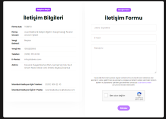
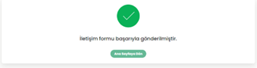
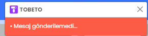
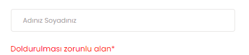
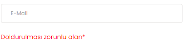
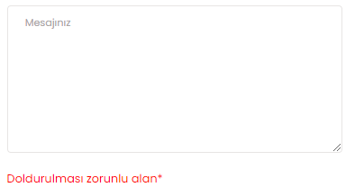
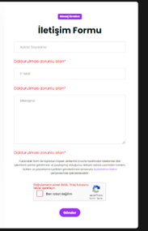

<h1>TEST SENERYOSU: İLETİŞİM FORMU</h1>
<b>Açıklama :</b> Tobeto eğitim platformuna kullanıcıların e-posta ve şifre ile sisteme giriş yapmış olduğu platform üzerinde ‘’Bize Ulaşın’’ paneli kontrol edilecektir. 
<b>Ön koşullar :</b> Kullanıcı panale başarılı bir şekilde giriş yapmış olmalıdır.   

<h4>Test Case 1: Bize ulaşın butonu</h4>
<b>Açıklama :</b> “Bize Ulaşın’’ sekmesi görüntülenmesi test edilecektir. 
<b>Ön koşul :</b> Kullanıcı sistemde oturum açmış olmalıdır. Sayfada “Bize Ulaşın’’ butonu tıklanabilir olmalıdır.  
<b>Adımlar:</b> 
<b>1-</b> Ana sayfa üzerinde en alta in. 
<b>2-</b> 'Bize Ulaşın' butonuna tıkla.   
  
<b>Beklenen sonuç:</b> 'İletişim' paneline yönlendirilmelidir. 

<h4>Test Case 2:İletişim formunun görüntülenmesi</h4>
<b>Açıklama :</b> “İletişim’’ paneli görüntülenmesi test edilecektir. 
<b>Ön koşul :</b> Kullanıcı sistemde oturum açmış olmalıdır. . “Bize Ulaşın’’ butonu tıklanabilir olmalıdır.  
<b>Adımlar:</b> 
<b>1-</b> Bize ulaşın butonuna tıkla. 
<b>2-</b> 'İletişim' panelinin görüntülendiğini ve sayfasının içeriğini kontrol et.  
<b>Beklenen sonuç:</b> 'İletişim' paneli görüntülenmelidir.Aşağıda görseli verilmiştir.  
 

<h4>Test Case 3:İletişim formu başarılı</h4>
<b>Açıklama :</b> “İletişim Formu’’ panelde görüntülenebilir ve tıklanabilir olmalıdır. 
<b>Ön koşul :</b> Kullanıcı sistemde oturum açmış olmalıdır. İletişim paneli açık olmalıdır.  
<b>Adımlar:</b> 
<b>1-</b> Bize ulaşın butonuna tıkla. 
<b>2-</b> 'İletişim Formu' panelinin görüntülendiğini ve tıklanabilirliğini kontrol et. 
<b>3-</b> 'Adınız Soyadınız' alanına isim ve soyisim gir. 
İnput : Tobeto 
<b>4-</b> 'E-Mail' alanına bir mail adresi gir. 
İnput : tobeto@test.com 
<b>5</b>-Mesaj kutusuna bir veri gir. 
İnput:Merhaba tobeto 
<b>6-</b>Gönder butonuna tıkla. 
<b>7-</b>“İletişim formu başarıyla gönderilmiştir.”uyarısı geldiğini kontrol et.  

<b>Beklenen sonuç:</b> 'İletişim Formu' istenildiği gibi çalışmalıdır.Ekrana iletişim formu başarıyla gönderilmiştir yazısı gelmelidir aşağıda görseli verilmiştir.  

 
<h4>Test Case 4: İletişim formu başarısız</h4>

<b>Açıklama :</b> “İletişim Formu’’ panelde görüntülenebilir ve tıklanabilir olmalıdır.Yanlış bilgilerle test et. 
<b>Ön koşul :</b> Kullanıcı sistemde oturum açmış olmalıdır. Sayfada “Bize Ulaşın’’ butonu tıklanabilir olmalıdır.  
<b>Adımlar:</b> 
<b>1-</b> Bize ulaşın butonuna tıkla. 
<b>2-</b> 'İletişim Formu' panelinin görüntülendiğini ve tıklanabilirliğini kontrol et. 
<b>3-</b> 'Adınız Soyadınız' alanına geçersiz isim ve soyisim gir. 
İnput : geçersizisim 
<b>4-</b> 'E-Mail' alanına geçersiz bir mail adresi gir. 
İnput : tobeto@tobeto 
<b>5-</b>Mesaj kutusuna bir veri gir. 
İnput:geçersiz mesaj 
<b>6-</b>Gönder butonuna tıkla. 
<b>7-</b>“Mesaj gönderilemedi...”uyarısı geldiğini kontrol et.  

<b>Beklenen sonuç:</b> 'İletişim Formu' istenildiği gibi çalışmamalıdır bize bir mesaj gönderilemedi uyarısı vermelidir.Aşağıda görseli verilmiştir.  
 

<h4>Test Case 5:İletişim formu boş bırak</h4>

<b>Açıklama :</b> “İletişim Formu’’ panelde görüntülenebilir ve tıklanabilir olmalıdır.Doldurulacak alanları boş bırakıp test edilecektir. 
<b>Ön koşul :</b> Kullanıcı sistemde oturum açmış olmalıdır. Sayfada “Bize Ulaşın’’ butonu tıklanabilir olmalıdır. 
<b>Adımlar:</b> 
<b>1-</b> Bize ulaşın butonuna tıkla. 
<b>2-</b> 'İletişim Formu' panelinin görüntülendiğini ve tıklanabilirliğini kontrol et. 
<b>3-</b> 'Adınız Soyadınız' alanına isim ve soyisim gir. 
İnput :  
  
<b>4-</b> 'E-Mail' alanına bir mail adresi gir. 
İnput :  
  
<b>5-</b>Mesaj kutusuna bir veri gir. 
İnput: 
  
<b>6-</b>Gönder butonuna tıkla. 
<b>7-</b>“Doldurulması zorunlu alan*”uyarısı geldiğini kontrol et.  
<b>Beklenen sonuç:</b> 'İletişim Formu'da alanlar boş bırakıldığında  bize doldurulması zorunlu alan  uyarısı vermelidir.Aşağıda görseli verilmiştir.  
 
 

