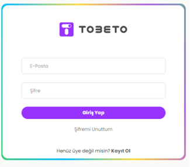
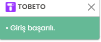
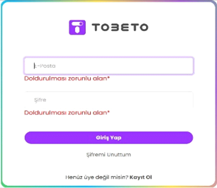
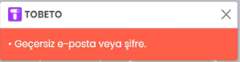
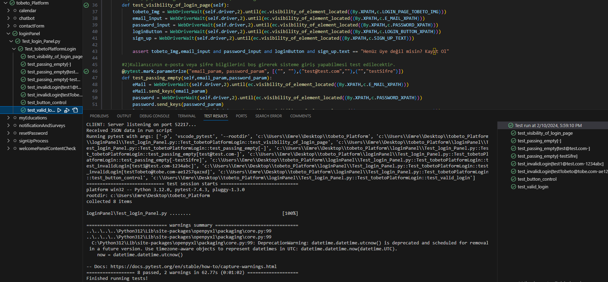

<h1>TEST SENERYOSU 1 GİRİŞ KONTROL </h1>
<b>Açıklama :</b> Tobeto eğitim platformuna kullanıcıların e-posta ve şifre ile sisteme giriş yapabilmesi kontrol edilecektir. 
<b>Ön koşullar :</b> Test ortamı çalışır ve hazır durumda olmalıdır. ‘’https://tobeto.com/giris’’ sayfası erişilebilir olmalıdır.  

<h4>Test Case 1 : Giriş yap alanının görüntülenebilmesi.</h4>
<b>Açıklama :</b> Giriş yap alanı görüntülenebilir ve işlevselliği test edilecektir. 
<b>Ön koşul :</b> Giriş yap paneli erişilebilir olmalıdır.  
<b>Adımlar:</b> 
<b>1-</b> Giriş yap alanının içerisinde Tobeto amblemi, E-posta alanı, Şifre alanı, "Giriş Yap" butonu, "Şifremi Unuttum" bağlantısı, "Henüz Üye Değil misin? Kayıt Ol" bağlantısı alanlarını kontrol et.   
<b>Beklenen Sonuç :</b> Giriş yap alanı görseldeki gibi olmalıdır .  
                        

<h4>Test Case 2 : Başarılı panel girişi.</h4>
<b>Açıklama :</b> Kullanıcının sistemde kayıtlı e-posta ve şifre bilgileriyle  giriş yapabilmesi test edilecektir. 
<b>Ön koşul :</b> Kullanıcının giriş yaptığı e-posta ve şifre sisteme kayıtlı olmalıdır .  
<b>Adımlar:</b> 
<b>1-</b> E-posta adresi gir. 
İnput: basarili@test.com 
<b>2-</b>Şifre gir. 
İnput: basarilisifre 
<b>3-</b>Giriş yap butonuna tıkla  
<b>Beklenen Sonuç :</b> Panele giriş yapılmış ve sistem tarafından görseldeki gibi bildirme mesajı gelmelidir.  

<h4>Test Case 3 : Boş bilgi girişi.</h4>
<b>Açıklama :</b> Kullanıcının e-posta veya şifre bilgilerini boş girerek sisteme giriş yapabilmesi test edilecektir. 
<b>Ön koşul :</b> E-posta veya şifre boş bırakılmalıdır.  
<b>Adımlar:</b> 
<b>1-</b>E-posta adresi gir. 
      1.1- E-posta adresi gir. 
      İnput: test@test.com 
      1.2- E-posta adresini boş bırak. 
      İnput:  
      1.3-E-posta adresini boş bırak. 
      İnput: 
<b>2-</b>Şifre gir. 
     2.1-Şifre alanını boş bırak. 
     İnput:  
     2.2-test123 
     İnput:sifretest 
     2.3-Şifre alanını boş bırak. 
       İnput: 
<b>3-</b>Giriş yap butonuna tıkla  
<b>Beklenen Sonuç :</b> E-posta veya şifre alanları boş bırakıldığında alanların alt kısmında görseldeki hata mesajlarını vermelidir.  
                                 
 
                    
<h4>Test Case 4 : Başarısız panel girişi.</h4>
<b>Açıklama :</b> Kullanıcının e-posta ve şifre bilgilerini yanlış girerek sisteme giriş yapması  test edilecektir. 
<b>Ön koşul :</b> E-posta veya şifre eksik yada geçersiz olmalıdır.  
<b>Adımlar:</b> 
<b>1-</b>E-posta adresi gir. 
      1.1- Geçersiz e-posta adresi gir. 
      İnput: basarisiz@test.com 
      1.2- Geçerli e-posta adresi gir. 
      İnput: basarili@test.com 
<b>2-</b>Şifre gir. 
     2.1-Geçerli bir şifre gir. 
     İnput: basarilisifre 
     2.2-Geçersiz bir şifre gir. 
     İnput:basarisizsifre 
<b>3-</b>Giriş yap butonuna tıkla  
<b>Beklenen Sonuç :</b>  Sistemde kayıtlı olmayan yada geçersiz e-posta veya şifre girildiğinde  görseldeki hata mesajlarını vermelidir.  
                  

                    
<h4>Test Case 5 : Giriş yap sayfası içerisindeki butonların işlevselliği .</h4>
<b>Açıklama :</b> Kullanıcının giriş yap sayfasındaki butonların işlevselliği test edilecektir. 
<b>Ön koşul :</b> Giriş yap sayfası görüntülenebilir ve butonlar tıklanabilir olmalıdır.  
<b>Adımlar:</b> 
<b>1-</b> E-posta ve Şifre inputlarının işlevselliğini kontrol et.   
<b>2-</b>Giriş yap butonunun işlevselliğini kontrol et. 
<b>3-</b>Şifremi unuttum bağlantısı,’’Henüz üye değilmisiniz?Kayıt ol’’ bağlantılarının işlevselliğini kontrol et.  

<b>Beklenen Sonuç :</b>  İnput,buton ve bağlantı alanları tıklanabilir olmalıdır.  

<h2>PYTEST TEST SONUÇLARI</h2> 
