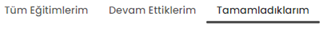

<h1>TEST SENERYOSU 8: EĞİTİM PANELİ</h1>
<b>Açıklama :</b> Tobeto eğitim platformuna kullanıcıların e-posta ve şifre ile sisteme giriş yapmış olduğu platform üzerinde ‘’Eğitim’’ paneli kontrol edilecektir. 
<b>Ön koşullar :</b> Kullanıcı panale giriş yapmış olmalı ve eğitimleri atanmış olmalıdır.  

<h4>Test Case 1: Eğitimlerim Sayfasının Görüntülenmesi</h4>
<b>Açıklama :</b> “Eğitimlerim’’ sekmesi görüntülenmesi test edilecektir. 
<b>Ön koşul :</b> Sayfada ‘’Eğitimlerim’’  butonu tıklanabilir olmalıdır.  
<b>Adımlar:</b> 
<b>1-</b> Ana sayfada ‘’Eğitimlerim’’butonuna tıkla. 
<b>2-</b> Tanımlanmış eğitimlerin görünürlüğünü kontrol et.  
<b>Beklenen sonuç:</b> ‘’Eğitimlerim’’sayfasında 4 adet eğitim görüntülenmelidir. Aşağıda görselleri verilmiştir.  
 
<h4>Test Case 2: Daha Fazla Göster Butonu</h4> 
<b>Açıklama:</b> Eğitimlerim sekmesi altında ‘’Daha Fazla Göster Butonu’’ test edilecektir. 
<b>Ön koşul :</b> Sayfada ‘’Daha Fazla Göster Butonu’’ tıklanabilir olmalıdır.  
<b>Adımlar:</b> 
<b>1-</b> Ana sayfada ‘’Eğitimlerim’’butonuna tıkla. 
<b>2-</b>"Daha Fazla Göster" butonuna tıkla. 
 
<b>3-</b> "Eğitimlerim" sayfasına başarıyla yönlendirildiğini ve sayfanın başlığının doğru bir şekilde görüntülendiğini kontrol et.   
<b>Beklenen sonuç:</b> Eğitimlerim sayfası görüntülenmelidir. Aşağıda görseli verilmiştir.   
 
<h4>Test Case 3 : Arama çubuğu başarılı arama</h4>
<b>Açıklama: :</b> Kendilerine atanmış eğitimlere ‘’Arama Çubuğu’’ ile test edilecektir. 
<b>Ön koşul :</b>  Daha fazla göster Sayfasında ‘’Arama Çubuğu Görüntülenebilir ’’ kullanılabilir olmalıdır.  
<b>Adımlar:</b> 
<b>1-</b>Arama çubuğuna bir karakter girişi yap. 
İnput : mentör 
<b>2-</b> Eşleşen karakterlere ait ilgili eğitimlerin listelendiğini kontrol et.  
<b>3-</b> Sayfayı yenile ve sayfanın yenilendiğinde arama ayarlarının sıfırlandığını ve tüm eğitimlerin görüntülendiğini kontrol et.  
<b>Beklenen sonuç:</b>Arama çubuğu ile eşleşen karakterlere ait ilgili eğitimler görüntülenmelidir. Aşağıdaki görseldeki gibi olmalı.  
  

<h4>Test Case 4 : Arama çubuğu başarısız arama</h4>
<b>Açıklama: :</b> Kendilerine atanmış eğitimlere ‘’Arama Çubuğu’’ ile test edilecektir. 
<b>Ön koşul :</b> Daha fazla göster Sayfasında ‘’Arama Çubuğu Görüntülenebilir ’’ kullanılabilir olmalıdır.  

<b>Adımlar:</b> 
<b>1-</b>Arama çubuğuna bir karakter girişi yap. 
İnput:tobeto 
<b>2-</b> "Size atanan herhangi bir eğitim bulunmamaktadır." yazısının görüntülendiğini kontrol et. 
<b>3-</b> Sayfayı yenile ve sayfanın yenilendiğinde arama ayarlarının sıfırlandığını ve tüm eğitimlerin görüntülendiğini kontrol et. 
<b>Beklenen sonuç:</b>Arama çubuğuna eşleşmeyen karakter girildiğinde “size atanan herhangi bir eğitim bulunmamaktadır”yazısı görüntülenmelidir.  
 
<h4>Test Case 5 : Filtreleme çubuğu başarılı listeleme</h4>
<b>Açıklama:</b> ‘’Filtreleme Çubuğu’’kullanımı test edilecektir. 
<b>Ön koşul :</b> Daha fazla göster Sayfasında ‘’Filtreleme Çubuğu Görüntülenebilir ’’ kullanılabilir olmalıdır.  
<b>Adımlar:</b> 
<b>1-</b> Filtreleme çubuğunun içerisinde "Kurum Seçiniz" yazısının bulunduğunu kontrol et. 
<b>2-</b> Filtreleme çubuğunun üstüne tıkladığında eğitimleri veren kurumların adının açılır listede görüntülendiğini ve karakter girişi yapabildiğini kontrol et. 
 
<b>3-</b> Karakter girişi yap ve kurum ara. 
İnput :İstanbul 
 
<b>4-</b> Seçilen kurumların verdiği eğitimlerin listelendiğini kontrol et.  
 
<b>Beklenen sonuç :</b> Filtreleme sonucu eğitimler listelenmelidir. Aşağıdaki görseldeki gibi olmalıdır.  
 

<h4>Test Case 6 : Filtreleme çubuğu başarısız listeleme</h4>
<b>Açıklama:</b> ‘’Filtreleme Çubuğu’’kullanımı test edilecektir. 
<b>Ön koşul :</b> Daha fazla göster Sayfasında ‘’Filtreleme Çubuğu Görüntülenebilir ’’ kullanılabilir olmalıdır.  
<b>Adımlar:</b> 

1-</b>Filtreleme çubuğuna tıkla. 
 
<b>2-</b> Karakter girişi yap. 
İnput:tobeto 
<b>3-</b>Girilen karakterlerle eşleşen kurum adı bulunamadığında "Seçenek Bulunamadı" yazısının görüntülendiğini kontrol et.  
<b>Beklenen sonuç :</b> Filtreleme çubuğu istenildiği gibi çalışmalıdır.Aşağıdaki görseldeki gibi olmalıdır.  
 

<h4>Test Case 7 : Sıralama çubuğu adına göre sıralama</h4>
<b>Açıklama:</b> ‘’Sıralama Çubuğu’’kullanımı test edilecektir. 
<b>Ön Koşul:</b> Sayfada “Sıralama Çubuğu Görüntülenebilir ’’ kullanılabilir olmalıdır.  
<b>Adımlar:</b> 
<b>1-</b> Sıralama çubuğunun üzerine tıkla. 
<b>2-</b> Açılır listede sıralama seçeneklerinin bulunduğunu ve farklı seçeneklerle eğitimlerin sıralandığını kontrol et.“Z-A” ya tıkla. 
 
<b>3-</b> Filtrelemenin seçime göre geldiğini kontrol et.  
<b>Beklenen sonuç :</b> Sıralama çubuğunun işlevselliği adına göre istenildiği gibi çalışmalıdır.Görseldeki gibi olmalıdır.  
 

<h4>Test Case 8 : Sıralama çubuğu tarihe göre sıralama </h4>
<b>Açıklama:</b> ‘’Sıralama Çubuğu’’kullanımı test edilecektir. 
<b>Ön Koşul:</b> Sayfada “Sıralama Çubuğu Görüntülenebilir ’’ kullanılabilir olmalıdır.  
<b>Adımlar:</b> 
<b>1-</b> Sıralama çubuğunun üzerine tıkla. 
<b>2-</b> Açılır listede sıralama seçeneklerinin bulunduğunu ve farklı seçeneklerle eğitimlerin sıralandığını kontrol et.“Y-E” ye tıkla. 
<b>3-</b> Filtrelemenin seçime göre geldiğini kontrol et.  

<b>Beklenen sonuç :</b> Sıralama çubuğunun tarihe göre sıralama işlevselliği istenildiği gibi çalışmalıdır.Görseldeki gibi olmalıdır.  

 

<h4>Test Case 9 : "Tüm Eğitimlerim", "Devam Ettiklerim" ve "Tamamladıklarım"</h4>
<b>Açıklama:</b> "Tüm Eğitimlerim", "Devam Ettiklerim" ve "Tamamladıklarım" butonları test edilecektir. 
<b>Ön Koşul:</b> Sayfada "Tüm Eğitimlerim", "Devam Ettiklerim" ve "Tamamladıklarım" sekmeleri görünür ve kullanılabilir olmalıdır.  
<b>Adımlar:</b> 
<b>1-</b>"Tüm Eğitimlerim" butonuna tıkla.  
 
<b>2-</b>"Tüm Eğitimlerim" kısmına gittiğini kontrol et. 
<b>3-</b>"Devam Ettiklerim" butonuna tıkla.  
 
<b>4-</b>"Devam Ettiklerim" kısmına gittiğini kontrol et. 
<b>5-</b> "Tamamladıklarım" butonuna tıkla.  
 
<b>6-</b>"Tamamladıklarım"  kısmına gittiğini kontrol et.  

<b>Beklenen sonuç :</b> Sayfada "Tüm Eğitimlerim", "Devam Ettiklerim" ve "Tamamladıklarım" sekmelerinin işlevselliği başarıyla çalışmalıdır.  

<h4>Test Case 10 : 'Eğitime Git' Butonu kontrolleri</h4>
<b>Açıklama :</b> Eğitim içeriğinin görüntülenmesi test edilecektir. 
<b>Ön Koşullar:</b>  Eğitim sayfasına giriş yapılmış olmalıdır.   
<b>Adımlar:</b> 
<b>1-</b>Eğitime git butonuna tıkla. 
 
<b>2-</b>Sayfa içeriğini kontrol et.  

<b>Beklenen Sonuçlar:</b> Eğitim içeriği görseldeki  gibi görüntülenmelidir.   
 

 

