<h1>TEST SENERYOSU 9 : DUYURU HABERLERİM VE ANKETLERİM SAYFASININ KONTROLÜ</h1>
<b>Açıklama :</b> Duyuru ve Haberlerim butonu ile birlikte duyurularım sayfasının adının bulunduğu görsel, arama çubuğu ,tür filtreleme, organizasyon filtreleme ve sıralama çubukları kontrol edilecektir. 
<b>Ön koşullar :</b> Test ortamı çalışır ve hazır durumda olmalıdır. ‘’ https://tobeto.com/platform’’ sayfası erişilebilir olmalıdır.  

<h4>Test case 1: “Duyuru ve Haberlerim” Butonu Kontrolü</h4>
<b>Açıklama:</b>Kullanıcının duyuru ve haberlerini takip edeceği panel test edilecektir. 
<b>Ön Koşul:</b>Kullanıcı başarılı bir şekilde sisteme giriş yapmalıdır.  
<b>Adımlar:</b> 
<b>1-</b>Call test(test senaryosu:Giriş kontrol/ test case1:Başarılı panel girişi) 
<b>2-</b>Duyuru ve Haberlerim başlığını tıkla. 
<b>3-</b>Aşağıdaki görseldeki gibi max 3 adet duyuru gösterildiğini kontrol et. 
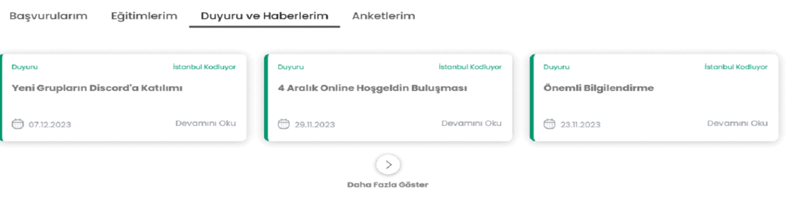  
<b>4-</b>”Devamını Oku”  tıkla. 
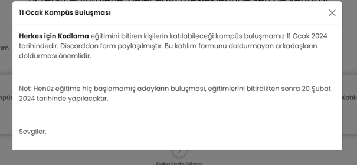   
<b>5-</b>Açılan Duyuru X butonuna tıkla.  
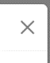
<b>Beklenen Sonuç:</b> Duyuru kapanmalıdır.  
<h4>Test case 2:”Daha Fazla Göster “ butonun kontrolü</h4>
<b>Açıklama:</b> “Daha Fazla Göster “ butonuna basarak yeni pencerenin açılması durumu test edilecektir. 
<b>Ön Koşul:</b> https://tobeto.com/platform hazır çalışır durumda olması gerekir.  
<b>Adımlar:</b> 
<b>1-</b>Call test(test senaryosu:Giriş kontrol/ test case1:Başarılı panel girişi 
<b>2-</b>“Daha Fazla Göster” butonuna tıkla  
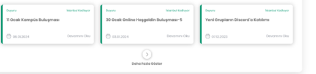 
<b>Beklenen Sonuç:</b> “Daha Fazla Göster” butonuna basarak yeni pencere açılır.  
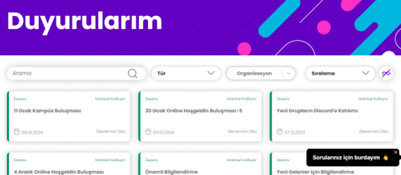 

<h4>Test case 3: “Arama” Butonun Kontrolü</h4>
<b>Açıklama:</b> Arama çubuğunda aratılan kritere uygun duyuru bulunması test edilecektir. 
<b>Ön Koşul:</b> https://tobeto.com/duyurular sayfası hazır ve çalışır olması gerekir.  
<b>Adımlar:</b> 
<b>1-</b>Call test(test senaryosu:Giriş kontrol/ test case1:Başarılı panel girişi) 
<b>2-</b>Duyuru ve haberlerim butonuna tıkla 
<b>3-</b>“Daha fazla göster” butonuna tıkla 
<b>4-</b>Arama butonuna input gir. 
input:Önemli   
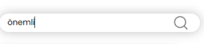 
<b>Beklenen Sonuç:</b> Görseldeki gibi olmalıdır.  
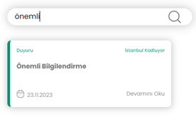 

<h4>Test case 4: Arama filtresinde “Bir Duyuru Bulunmamaktadır” Butonun Kontrolü</h4>
<b>Açıklama:</b> Arama çubuğunda aratılan kritere uygun duyuru bulunmaması test edilecektir. 
<b>Ön Koşul:</b> https://tobeto.com/duyurular sayfası hazır ve çalışır olması gerekir.  
<b>Adımlar:</b> 
<b>1-</b>Call test(test senaryosu:Giriş kontrol/ test case1:Başarılı panel girişi) 
<b>2-</b>Duyuru ve haberlerim butonuna tıkla 
<b>3-</b>“Daha fazla göster” butonuna tıkla 
<b>4-</b>Arama butonuna input gir. 
<b>input:Sınav</b>  
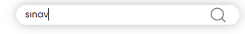 
<b>Beklenen sonuç:</b> “Bir duyuru bulunmamaktadır”yazısı gelir.  
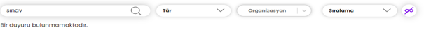 
<h4>Test case 5:”Tür” Başlığının Kontrolü</h4>
<b>Açıklama:</b>Kullanıcının “tür” filtrelemesini kullanarak “Haber” ve “Duyuru” başlıkları test edilecektir. 
<b>Ön Koşul:</b> https://tobeto.com/duyurular sayfası hazır olmalıdır.  
<b>Adımlar:</b> 
<b>1-</b>Call test(test senaryosu:Giriş kontrol/ test case1:Başarılı panel girişi) 
<b>2-</b>Duyuru ve haberlerim butonuna tıkla 
<b>3-</b>daha fazla göster butonuna tıkla 
<b>4-</b>tür filtresine tıkla  
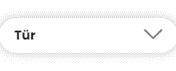 
<b>Beklenen Sonuç:</b>Aşağıdaki görseldeki gibi olmalıdır.  
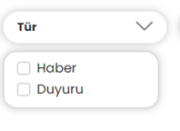 

<h4>Test case 6:”Organizasyon” Başlığının Kontrolü</h4>
<b>Açıklama:</b>Kullanıcının “Organizasyon” filtreleme çubuğunun organizasyonları filtrelemesi test edilecektir. 
<b>Ön Koşul:</b> https://tobeto.com/duyurular sayfası hazır olmalıdır.  
<b>Adımlar:</b> 
<b>1-</b>Call test(test senaryosu:Giriş kontrol/ test case1:Başarılı panel girişi) 
<b>2-</b>Duyuru ve haberlerim butonuna tıkla 
<b>3-</b>“Daha fazla göster” butonuna tıkla 
<b>4-</b>“Organizasyon”Filtreleme çubuğunu göster.  
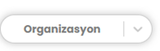 
<b>Beklenen Sonuç:</b>Görseldeki gibi gelmelidir.  
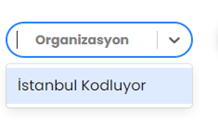

<h4>Test case 7:Organizasyon filtresinde ”Seçenek Bulunamadı”Başlığının Kontrolü</h4>
<b>Açıklama:</b>Kullanıcının “Organizasyon” filtreleme çubuğunun organizasyonları filtrelemesi test edilecektir. 
<b>Ön Koşul:</b> https://tobeto.com/duyurular sayfası hazır olmalıdır.  
<b>Adımlar:</b> 
<b>1-</b>Call test(test senaryosu:Giriş kontrol/ test case1:Başarılı panel girişi) 
<b>2-</b>Duyuru ve haberlerim butonuna tıkla 
<b>3-</b>“Daha fazla göster” butonuna tıkla 
<b>4-</b>“Organizasyon “filtre çubuğunu göster 
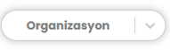 
<b>5-</b>input gir  
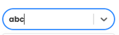 
<b>Beklenen Sonuç:</b> Girilen karakterlerle eşleşen organizasyon bulunmadığında aşağıdaki görseldeki gibi “Seçenek Bulunamadı” yazısı gelmelidir.  
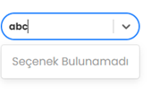
<h4>Test case 8:”Sıralama” Başlığının Kontrolü</h4>
<b>Açıklama:</b> Kullanıcının “Sıralama” filtreleme çubuğunun açılır kapanır listede “Tarihe Göre(Y-E)” ve “Tarihe Göre (E-Y) seçenekleri test edilecektir. 
<b>Ön Koşul:</b> https://tobeto.com/duyurular sayfası hazır olmalıdır.  
<b>Adımlar:</b> 
<b>1-</b>Call test(test senaryosu: Giriş kontrol/ test case1:Başarılı panel girişi) 
<b>2-</b>Duyuru ve haberlerim butonuna tıkla 
<b>3-</b>“Daha fazla göster” butonuna tıkla 
<b>4-</b>“Sıralama” butonunu göster. 
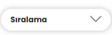 
<b>5-</b>“Tarihe Göre(Y-E)” göre sırala. 
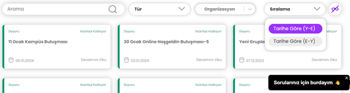
<b>6-</b>“Tarihe Göre (E-Y)” göre sırala.  
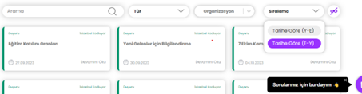 
<b>Beklenen Sonuç:</b> Duyurular filtrelemeye göre sıralanmalıdır.  

<h4>Test Case 9: Anketlerim kontrolü</h4>
<b>Açıklama:</b> Anketlerim butonuna tıklayarak kendisine atanmamış anket durumu test edilecektir. 
<b>Ön Koşul:</b> https://tobeto.com/platform hazır çalışır durumda olması gerekir.  
<b>Adımlar</b>: 
<b>1-</b>Call test(test senaryosu:Giriş kontrol/ test case1:Başarılı panel girişi) 
<b>2-</b> Anketlerim” başlığını tıkla.  
<b>Beklenen Sonuç:</b>Kullanıcı kendisine anket tanımlanmadığında aşağıdaki görseldeki gibi bir mesajı alacaktır.  
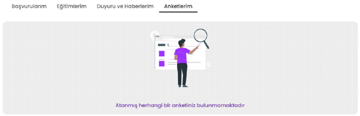

<h2>PYTEST TEST SONUÇLARI</h2> 
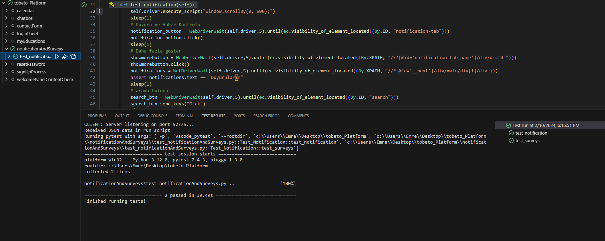

 

