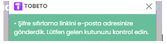
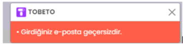

<h1>TEST SENERYOSU 4:Şifre yenile</h1>
<b>Açıklama:</b> Tobeto eğitim platformuna sahip kullanıcılar geçerli ve geçersiz e-posta ile şifre değiştirme işlemi yapabilmesi kontrol edebilme. 
<b>Ön koşullar :</b> Test ortamı çalışılabilir ve hazır olmalıdır. https://tobeto.com/sifremi-unuttum sayfası erişebilir olmalıdır. 

<h4>Test Case 1: Şifremi unuttum geçerli e-posta</h4>
<b>Açıklama :</b> Kullanıcının şifremi unuttum butonuna  tıklayarak  ‘’ Şifremi Unuttum ’’ sayfasında geçerli e-posta ile kullanıcının şifre sıfırlaması test edilecektir. 
<b>Ön koşullar :</b> Test ortamı çalışılabilir ve hazır olmalıdır. https://tobeto.com/sifremi-unuttum sayfası erişebilir olmalıdır.  
<b>Adımlar:</b> 
<b>1-</b> “https://tobeto.com/giris’’ url sayfasına git. 
<b>2-</b>Şifremi unuttum butonuna tıkla. 
<b>3-</b>‘’ https://tobeto.com/sifremi-unuttum’’ sayfasına gittiğini kontrol et. 
<b>4-</b>Şifre sıfırlama linki için e-posta adresinizi gir. 
İnput: test@tobeto.com 
<b>5-</b>Gönder butonuna tıkla. 
<b>Beklenen sonuç:</b> Kullanıcı gönder tuşuna bastığında girilen e-posta adresi sistemde bulunursa pop up şeklinde ekteki mesajla karşılaşmalıdır.  
                                                        

<h4>Test Case 2: Şifremi unuttum geçersiz e-posta</h4>
<b>Açıklama :</b> Kullanıcının şifremi unuttum butonuna tıklayarak ‘’ https://tobeto.com/sifremi-unuttum’’ sayfasında geçersiz e-posta ile kullanıcının şifre sıfırlaması test edilecektir. 
<b>Ön koşullar :</b> Test ortamı çalışılabilir ve hazır olmalıdır. https://tobeto.com/sifremi-unuttum sayfası erişebilir olmalıdır.  
<b>Adımlar:</b> 
<b>1-</b> ‘’https://tobeto.com/giris’’ url sayfasına git. 
<b>2-</b>Şifremi unuttum butonuna tıkla. 
<b>3-</b> “ https://tobeto.com/sifremi-unuttum’’ sayfasına gittiğini kontrol et. 
<b>4-</b>Şifre sıfırlama linki için e-posta adresinizi gir. 
İnput: test.tobeto.com 
<b>5-</b>Gönder butonuna tıkla. 
<b>Beklenen sonuç:</b> Kullanıcı gönder tuşuna bastığında girilen e-posta adresi geçersiz formatta ise pop-up şeklinde ekteki mesajla karşılaşmalıdır.  
                                                         

