<h1>TEST SENERYOSU 3 KAYIT OL İŞLEMİ</h1>
<b>Açıklama :</b> Tobeto eğitim platformuna kullanıcının kayıt olabilmesi kontrol edilecektir.
<b>Ön koşullar :</b> Test ortamı çalışır ve hazır durumda olmalıdır. ‘’https://tobeto.com/kayit-ol’’ sayfası erişilebilir olmalıdır.

<h4>Test Case 1 : Başarılı kayıt olma işlemi.</h4>
<b>Açıklama :</b> Kullanıcının istenilen bilgiler doğrultusunda (Ad,Soyad,E-posta,Şifre,Şifre Tekrar) alanları doldurulup sisteme kayıt olma işlemi test edilecektir. 
<b>Ön koşul :</b> ‘’https://tobeto.com/kayit-ol’’ sayfası erişilebilir olmalıdır.İstenilen bilgilerin doldurulması zorunlu olmalıdır.  
<b>Adımlar:</b>  
<b>1-</b></b> Call test ( test senaryosu 1/ Test Case 5 ) 
<b>2-</b></b>AD gir. 
İnput:test1 
<b>3-</b></b>Soyad gir. 
İnput:test2 
<b>4-</b></b>E-posta gir. 
İnput:12345@test.com 
<b>5-</b>Şifre gir. 
İnput:123456 
<b>6-</b>Şifre tekrar gir. 
İnput:123456 
<b>7-</b>Kayıt ol butonuna tıkla. 
<b>8-</b>Kayıt oluşturmak için gerekli sözleşmeler sayfası ekteki gibi  geldiğini kontrol et. 
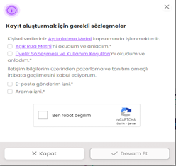                              
<b>9-</b> ‘’Kişisel verileriniz Aydınlatma Metni kapsamında işlenmektedir.’’ Başlığı altında bulunan ;
Açık Rıza  HYPERLINK "https://tobeto.com/yasal-metinler/acik-riza-metni"Metni’ni okudum ve anladım.*
Üyelik Sözleşmesi ve Kullanım  HYPERLINK "https://tobeto.com/yasal-metinler/tobeto-uyelik-sozlesmesi"Koşulları’nı okudum ve anladım.*
Checkboxlarını işaretle. 
<b>10-</b>E-posta gönderim izni checkboxını işaretle. 
<b>11-</b>Arama izni checkboxını işaretle. 
<b>12-</b>Altta ki görselde görünen panelin açıldığını kontrol et. 
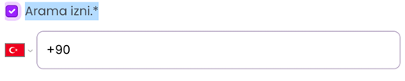
<b>13-</b>Telefon numarası gir. 
İnput:+90 312 123 45 67 
<b>14-</b>Ben robot değilim checkboxını işaretle. 
<b>15-</b>Devam et butonuna tıkla.  
<b>Beklenen Sonuç :</b> Panele başarılı bir şekilde kayıt yapabilmelidir.Ekte görülen görsel görüntülenmelidir.  
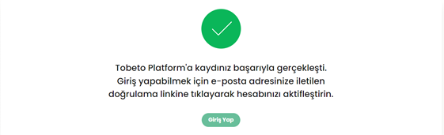 
<h4>Test Case 2 : Başarısız kayıt olma işlemi şifre en az altı karakter olmalı.</h4>
<b>Açıklama :</b> Kullanıcının istenilen bilgiler doğrultusunda (Ad,Soyad,E-posta,Şifre,Şifre Tekrar) alanları doldurulup sisteme kayıt olma işlemi test edilecektir. 
<b>Ön koşul :</b> ‘’https://tobeto.com/kayit-ol’’ sayfası erişilebilir olmalıdır.İstenilen bilgilerin doldurulması zorunlu olmalıdır.  
<b>Adımlar:</b>  
<b>1-</b> Call test ( test senaryosu 1/ Test Case 5 ) 
<b>2-</b>AD gir, Soyad gir. 
İnput:test1 
<b>3-</b>Soyad gir. 
İnput:test2 
<b>4-</b>E-posta gir. 
İnput:12345@test.com 
<b>5-</b>Şifre gir. 
İnput:123 
<b>6-</b>Şifre tekrar gir. 
İnput:123 
<b>7-</b>Kayıt ol butonuna tıkla. 
<b>8-</b>Kayıt oluşturmak için gerekli sözleşmeler sayfası ekteki gibi  geldiğini kontrol et. 
                             
<b>9-</b> ‘’Kişisel verileriniz Aydınlatma Metni kapsamında işlenmektedir.’’ Başlığı altında bulunan ;
Açık Rıza  HYPERLINK "https://tobeto.com/yasal-metinler/acik-riza-metni"Metni’ni okudum ve anladım.*
Üyelik Sözleşmesi ve Kullanım  HYPERLINK "https://tobeto.com/yasal-metinler/tobeto-uyelik-sozlesmesi"Koşulları’nı okudum ve anladım.*
Checkboxlarını işaretle. 
<b>10-</b>E-posta gönderim izni checkboxını işaretle. 
<b>11-</b>Arama izni checkboxını işaretle. 
<b>12-</b>Altta ki görselde görünen panelin açıldığını kontrol et.  

<b>13-</b>Telefon numarası gir. 
İnput:+90 312 123 45 67 
<b>14-</b>Ben robot değilim checkboxını işaretle. 
<b>15-</b>Devam et butonuna tıkla.  
<b>Beklenen Sonuç :</b> Ekrana hata mesajı gelmelidir.Ekte bulunan görseldeki gibi olmalıdır.  
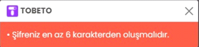                    
                    
<h4>Test Case 3 : Başarısız kayıt olma işlemi çift error hatası.</h4>
<b>Açıklama :</b> Kullanıcının istenilen bilgiler doğrultusunda (Ad,Soyad,E-posta,Şifre,Şifre Tekrar) alanları doldurulup sisteme kayıt olma işlemi test edilecektir. 
<b>Ön koşul :</b> ‘’https://tobeto.com/kayit-ol’’ sayfası erişilebilir olmalıdır.İstenilen bilgilerin doldurulması zorunlu olmalıdır.  
<b>Adımlar:</b>  
<b>1-</b> Call test ( test senaryosu 1/ Test Case 5 ) 
<b>2-</b>AD gir, Soyad gir. 
İnput:test1 
<b>3-</b>Soyad gir. 
İnput:test2 
<b>4-</b>E-posta gir. 
İnput:tobeto@test.com 
<b>5-</b>Şifre gir. 
İnput:123 
<b>6-</b>Şifre tekrar gir. 
İnput:123 
<b>7-</b>Kayıt ol butonuna tıkla. 
<b>8-</b>Kayıt oluşturmak için gerekli sözleşmeler sayfası ekteki gibi  geldiğini kontrol et. 
                             
<b>9-</b> ‘’Kişisel verileriniz Aydınlatma Metni kapsamında işlenmektedir.’’ Başlığı altında bulunan ; 
Açık Rıza  HYPERLINK "https://tobeto.com/yasal-metinler/acik-riza-metni"Metni’ni okudum ve anladım.*
Üyelik Sözleşmesi ve Kullanım  HYPERLINK "https://tobeto.com/yasal-metinler/tobeto-uyelik-sozlesmesi"Koşulları’nı okudum ve anladım.*
Checkboxlarını işaretle. 
<b>10-</b>E-posta gönderim izni checkboxını işaretle. 
<b>11-</b>Arama izni checkboxını işaretle. 
<b>12-</b>Altta ki görselde görünen panelin açıldığını kontrol et.  

<b>13-</b>Telefon numarası gir. 
İnput:+90 312 123 45 67 
<b>14-</b>Ben robot değilim checkboxını işaretle. 
<b>15-</b>Devam et butonuna tıkla.  
<b>Beklenen Sonuç :</b> Ekrana hata mesajı gelmelidir.Ekte bulunan görseldeki gibi olmalıdır.  
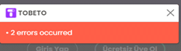                                       
<h4>Test Case 4 : Başarısız kayıt olma işlemi kayıtlı e-posta adresi.</h4>
<b>Açıklama :</b> Kullanıcının istenilen bilgiler doğrultusunda (Ad,Soyad,E-posta,Şifre,Şifre Tekrar) alanları doldurulup sisteme kayıt olma işlemi test edilecektir. 
<b>Ön koşul :</b> ‘’https://tobeto.com/kayit-ol’’ sayfası erişilebilir olmalıdır.İstenilen bilgilerin doldurulması zorunlu olmalıdır.  
<b>Adımlar:</b>  
<b>1-</b> Call test ( test senaryosu 1/ Test Case 5 ) 
<b>2-</b>AD gir, Soyad gir. 
İnput:test1 
<b>3-</b>Soyad gir. 
İnput:test2 
<b>4-</b>E-posta gir. 
İnput:tobeto@test.com 
<b>5-</b>Şifre gir. 
İnput:123456 
<b>6-</b>Şifre tekrar gir. 
İnput:123456 
<b>7-</b>Kayıt ol butonuna tıkla. 
<b>8-</b>Kayıt oluşturmak için gerekli sözleşmeler sayfası ekteki gibi  geldiğini kontrol et. 
                             
<b>9-</b> ‘’Kişisel verileriniz Aydınlatma Metni kapsamında işlenmektedir.’’ Başlığı altında bulunan ;
Açık Rıza  HYPERLINK "https://tobeto.com/yasal-metinler/acik-riza-metni"Metni’ni okudum ve anladım.*
Üyelik Sözleşmesi ve Kullanım  HYPERLINK "https://tobeto.com/yasal-metinler/tobeto-uyelik-sozlesmesi"Koşulları’nı okudum ve anladım.*
Checkboxlarını işaretle. 
<b>10-</b>E-posta gönderim izni checkboxını işaretle. 
<b>11-</b>Arama izni checkboxını işaretle. 
<b>12-</b>Altta ki görselde görünen panelin açıldığını kontrol et.  

<b>13-</b>Telefon numarası gir. 
İnput:+90 312 123 45 67 
<b>14-</b>Ben robot değilim checkboxını işaretle. 
<b>15-</b>Devam et butonuna tıkla.  
<b>Beklenen Sonuç :</b> Ekrana hata mesajı gelmelidir.Ekte bulunan görseldeki gibi olmalıdır.  
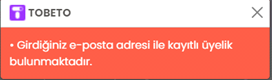                                       

<h4>Test Case 5: Başarısız kayıt olma işlemi eşleşmeyen şifre.</h4>
<b>Açıklama :</b> Kullanıcının istenilen bilgiler doğrultusunda (Ad,Soyad,E-posta,Şifre,Şifre Tekrar) alanları doldurulup sisteme kayıt olma işlemi test edilecektir. 
<b>Ön koşul :</b> ‘’https://tobeto.com/kayit-ol’’ sayfası erişilebilir olmalıdır.İstenilen bilgilerin doldurulması zorunlu olmalıdır.  
<b>Adımlar:</b>  
<b>1-</b> Call test ( test senaryosu 1/ Test Case 5 ) 
<b>2-</b>AD gir, Soyad gir. 
İnput:test1 
<b>3-</b>Soyad gir. 
İnput:test2 
<b>4-</b>E-posta gir. 
İnput:tobeto@test.com 
<b>5-</b>Şifre gir. 
İnput:1234566 
<b>6-</b>Şifre tekrar gir. 
İnput:1234567 
<b>7-</b>Kayıt ol butonuna tıkla. 
<b>8-</b>Kayıt oluşturmak için gerekli sözleşmeler sayfası ekteki gibi  geldiğini kontrol et. 
                             
<b>9-</b> ‘’Kişisel verileriniz Aydınlatma Metni kapsamında işlenmektedir.’’ Başlığı altında bulunan ;
Açık Rıza  HYPERLINK "https://tobeto.com/yasal-metinler/acik-riza-metni"Metni’ni okudum ve anladım.*
Üyelik Sözleşmesi ve Kullanım  HYPERLINK "https://tobeto.com/yasal-metinler/tobeto-uyelik-sozlesmesi"Koşulları’nı okudum ve anladım.*
Checkboxlarını işaretle. 
<b>10-</b>E-posta gönderim izni checkboxını işaretle. 
<b>11-</b>Arama izni checkboxını işaretle. 
<b>12-</b>Altta ki görselde görünen panelin açıldığını kontrol et.  

<b>13-</b>Telefon numarası gir. 
İnput:+90 312 123 45 67 
<b>14-</b>Ben robot değilim checkboxını işaretle. 
<b>15-</b>Devam et butonuna tıkla.  
<b>Beklenen Sonuç :</b> Ekrana hata mesajı gelmelidir.Ekte bulunan görseldeki gibi olmalıdır.  
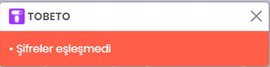                                      
                          

<h4>Test Case 6 :Eksik telefon numarası girmesi.</h4>
<b>Açıklama :</b> Kullanıcının istenilen bilgiler doğrultusunda (Ad,Soyad,E-posta,Şifre,Şifre Tekrar) alanları doldurulup sisteme kayıt olma işlemi test edilecektir. 
<b>Ön koşul :</b> ‘’https://tobeto.com/kayit-ol’’ sayfası erişilebilir olmalıdır.İstenilen bilgilerin doldurulması zorunlu olmalıdır.  
<b>Adımlar:</b>  
<b>1-</b> Call test ( test senaryosu 1/ Test Case 5 ) 
<b>2-</b>AD gir, Soyad gir. 
İnput:test1 
<b>3-</b>Soyad gir. 
İnput:test2 
<b>4-</b>E-posta gir. 
İnput:tobeto@test.com 
<b>5-</b>Şifre gir. 
İnput:1234566 
<b>6-</b>Şifre tekrar gir. 
İnput:1234567 
<b>7-</b>Kayıt ol butonuna tıkla. 
<b>8-</b>Kayıt oluşturmak için gerekli sözleşmeler sayfası ekteki gibi  geldiğini kontrol et. 
                             
<b>9-</b> ‘’Kişisel verileriniz Aydınlatma Metni kapsamında işlenmektedir.’’ Başlığı altında bulunan ;
Açık Rıza  HYPERLINK "https://tobeto.com/yasal-metinler/acik-riza-metni"Metni’ni okudum ve anladım.*
Üyelik Sözleşmesi ve Kullanım  HYPERLINK "https://tobeto.com/yasal-metinler/tobeto-uyelik-sozlesmesi"Koşulları’nı okudum ve anladım.*
Checkboxlarını işaretle. 
<b>10-</b>E-posta gönderim izni checkboxını işaretle. 
<b>11-</b>Arama izni checkboxını işaretle. 
<b>12-</b>Altta ki görselde görünen panelin açıldığını kontrol et.  

<b>13-</b>Telefon numarası gir. 
İnput:+05   
 
<b>Beklenen Sonuç :</b> Ekrana hata mesajı gelmelidir.Ekte bulunan görseldeki gibi olmalıdır.  
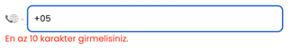

<h4>Test Case 7 : Geçersiz e-posta adresi.</h4>
<b>Açıklama :</b> Kullanıcının istenilen bilgiler doğrultusunda (E-posta) alanını doldurulup sisteme kayıt olma işlemi test edilecektir. 
<b>Ön koşul :</b> ‘’https://tobeto.com/kayit-ol’’ sayfası erişilebilir olmalıdır.İstenilen bilgilerin doldurulması zorunlu olmalıdır.  
<b>Adımlar:</b>  
<b>1-</b> Call test ( test senaryosu 1/ Test Case 5 ) 
<b>2-</b>E-posta gir. 
İnput:e  
<b>Beklenen Sonuç :</b> Ekrana hata mesajı gelmelidir.Ekte bulunan görseldeki gibi olmalıdır.  
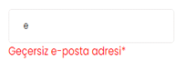                                      
                 
<h4>Test Case 8: Doldurulması gereken zorunlu alan.</h4>
<b>Açıklama :</b> Kullanıcının istenilen bilgiler doğrultusunda (Ad,Soyad,Şifre,Şifre Tekrar) alanları boş bırakılıp sisteme kayıt olma işlemi test edilecektir. 
<b>Ön koşul :</b> ‘’https://tobeto.com/kayit-ol’’ sayfası erişilebilir olmalıdır.  
<b>Adımlar:</b>  
<b>1- </b>Call test ( test senaryosu 1/ Test Case 5 ) 
<b>2-</b>AD gir sil. 
İnput:  
<b>3-</b>Soyad gir sil. 
İnput: 
<b>4-</b>E-posta gir. 
İnput:e 
<b>5-</b>Şifre gir sil. 
İnput: 
<b>6-</b>Şifre tekrar gir sil. 
İnput:  

<b>Beklenen Sonuç :</b> Ekrana hata mesajı gelmelidir.Ekte bulunan görseldeki gibi olmalıdır.  
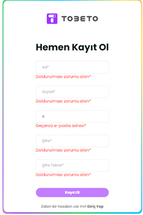                                        

<h4>Test Case 9: E-posta girip silme durumu.</h4>
<b>Açıklama :</b> Kullanıcının istenilen bilgiler doğrultusunda (E-posta) alanı girilip silinmesi test edilecektir. 
<b>Ön koşul :</b> ‘’https://tobeto.com/kayit-ol’’ sayfası erişilebilir olmalıdır.  
<b>Adımlar:</b>  
<b>1-</b> Call test ( test senaryosu 1/ Test Case 5 ) 
<b>2-</b>E-posta gir. 
İnput:e 
<b>3-</b>E-posta sil. 
İnput:  

<b>Beklenen Sonuç :</b> Ekrana hata mesajı gelmelidir.Ekte bulunan görseldeki gibi olmalıdır.  
 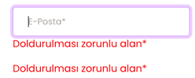                                 

