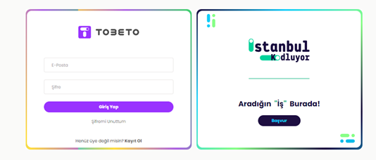

<h1>TEST SENERYOSU 7 HOŞGELDİN PANELİ İÇERİK KONTROLÜ</h1>
<b>Açıklama :</b> Tobeto eğitim platformunun içerikleri ve sayfalar arası gezinebilirliği kontrol edilecektir. 
<b>Ön koşullar :</b> Test ortamı çalışır ve hazır durumda olmalıdır. Kullanıcı giriş kısmından platforma e-posta ve şifre girerek platforma login olması gerekmektedir ve https://tobeto.com/platform url adresi erişilebilir olmalıdır.
<h4>Test Case 1 : Üst Menü(Navbar) Profilim Sekmesi </h4>
<b>Açıklama :</b> Kullanıcının Üst Menü üzerinde gezinebilirliği ve içeriklerinin görünürlüğü test edilecektir. 
<b>Ön koşul :</b> Kullanıcı platforma giriş yapmış olmalıdır.  
<b>Adımlar:</b> 
<b>1-</b> https://tobeto.com/platform url'e git. 
<b>2-</b> Üst menüde bulunan profilim sekmesine tıkla. 
<b>3-</b> https://tobeto.com/profilim url'e gittiğini kontrol et.  
<b>Beklenen Sonuç :</b> Kullanıcıya ait profil alanının görüntülenmesi gerekmektedir. Sayfanın url'i değişmiş olmalıdır.  

<h4>Test Case 2 : Kişisel Bilgilerim İçerik Kontrolü</h4>
<b>Açıklama :</b> Kullanıcının kişisel bilgi kısımlarının sayfa içerisinde görüntülenmesi test edilecektir. 
<b>Ön koşul :</b> Kullanıcı platforma giriş yapmış olmalıdır.  
<b>Adımlar:</b> 
<b>1-</b> Call Test (tc-9 Üst Menü(Navbar) Profilim Sekmesi  ) 
<b>2-</b> “Ad Soyad”, “Doğum Tarihi”, “E-posta Adresi”, “Telefon numarası” başlıklarının görüntülendiğini kontrol et. 
<b>3-</b> “Hakkımda”, “Yetkinliklerim”, “Yabancı Dillerim”, “Sertifikalarım”, “Medya Hesaplarım”, “Sertifikalarım” başlıklarının görüntülendiğini kontrol et.  
<b>Beklenen Sonuç :</b> Profilim Kısmında bulunan Kişisel Bilgilerim (
“Ad Soyad”, “Doğum Tarihi”, “E-posta Adresi”, “Telefon numarası”, “Hakkımda”, “Yetkinliklerim”, “Yabancı Dillerim”, “Sertifikalarım”, “Medya Hesaplarım”, “Sertifikalarım”) sayfa içerisinde görüntülenmelidir.   

<h4>Test Case 3: Tobeto Profil Linki</h4>
<b>Açıklama :</b> Kullanıcının profil linkini kopyalayabilmesi test edilecektir. 
<b>Ön koşul :</b> Kullanıcı platforma giriş yapmış olmalıdır.  
<b>Adımlar:</b> 
<b>1-</b> call test (tc-9 Üst Menü(Navbar) Profilim Sekmesi) 
<b>2-</b> Bağlantı butonuna tıkla. 
 
<b>3-</b> Profil linki penceresinin açıldığını kontrol et 

<b>4-</b> Linki kopyala butonuna tıkla 
 
<b>5-</b> ”Url kopyalandı.” Mesajının görüntülendiğini kontrol et.  
<b>Beklenen Sonuç :</b> Ekrana sistem mesajı gelmelidir.Ekte bulunan görseldeki gibi olmalıdır.  
  
 
<h4>Test Case 4 : Üst Menü(Navbar) Değerlendirmeler Sekmesi</h4>
<b>Açıklama :</b> Kullanıcının Üst Menü üzerinde gezinebilirliği ve içeriklerinin görünürlüğü test edilecektir. 
<b>Ön koşul :</b> Kullanıcı platforma giriş yapmış olmalıdır.  
<b>Adımlar:</b> 
<b>1-</b> https://tobeto.com/platform url'e git. 
<b>2-</b> Üst menüde bulunan değerlendirmeler sekmesine tıkla 
<b>3-</b> https://tobeto.com/degerlendirmeler url'e gittiğini kontrol et. 
<b>4-</b> Değerlendirmeler sekmesinin seçilip aktif olduğunu kontrol et. 
<b>5-</b>  “Yetkinliklerini ücretsiz ölç, bilgilerini test et”. yazısının sayfa içerisinde görüntülendiğini kontrol et.  

<b>Beklenen Sonuç :</b> Kullanıcı değerlendirmeler sayfasını ve içeriklerini görüntüleyebilmelidir. Sayfanın url'i değişmiş olmalı ve “Yetkinliklerini ücretsiz ölç, bilgilerini test et”. yazısı gelmelidir. görseldeki gibi olmalıdır.  
 
 
<h4>Test Case 5: Tobeto İşte Başarı Modeli Yetkinlik Testi Başla</h4>
<b>Açıklama :</b> Kullanıcının Değerlendirmeler sayfasında gezinebilirliği ve içeriklerinin görünürlüğü test edilecektir. 
<b>Ön koşul :</b> Kullanıcı platforma giriş yapmış olmalıdır.  
<b>Adımlar:</b> 
<b>1-</b> call test (tc-10 Üst Menü(Navbar) Değerlendirmeler Sekmesi) 
<b>2-</b> Tobeto İşte Başarı Modeli Alanında bulunan başla butonuna tıkla. 
 
<b>3-</b> “https://tobeto.com/profilim/degerlendirmeler/tobeto-iste-basari-modeli”url'e gittiğini kontrol et.  
<b>Beklenen Sonuç :</b> Tobeto işte Başarı Modeli yetkinlik testi sayfasına gidilebilmelidir. Görseldeki gibi olmalıdır.  
 
 
<h4>Test Case 6: Yazılımda Başarı Testi</h4>
<b>Açıklama :</b> Kullanıcının Değerlendirmeler sayfasında gezinebilirliği ve içeriklerinin görünürlüğü test edilecektir. 
<b>Ön koşul :</b> Kullanıcı platforma giriş yapmış olmalıdır.  
<b>Adımlar:</b> 
<b>1-</b> call test (tc-10 Üst Menü(Navbar) Değerlendirmeler Sekmesi) 
<b>2-</b> “Front End“, “Full Stack“, “Back End“, “Microsoft SQL Server“ ve “Masastü Programlama“ olmak üzere 5 tane test geldiğini kontrol et.  
<b>Beklenen Sonuç :</b> Yazılımda başarı test içerikleri “Front End“, “Full Stack“, “Back End“, “Microsoft SQL Server“ ve “Masastü Programlama“ olmak üzere 5 tane olmalıdır. Ve görseldeki gibi görünmelidir.  
  

<h4>Test Case 7: Yazılımda Başarı Testi Başla Buton Kontrolleri</h4>
<b>Açıklama :</b> Kullanıcının Değerlendirmeler sayfasında gezinebilirliği ve içeriklerinin görünürlüğü test edilecektir. 
<b>Ön koşul :</b> Kullanıcı platforma giriş yapmış olmalıdır.  
<b>Adımlar:</b> 
<b>1-</b> call test (tc-10 Üst Menü(Navbar) Değerlendirmeler Sekmesi) 
<b>2-</b> Yazılımda Başarı Testi içerisinde  5 tane buton görüntülendiğini kontrol et.  
<b>Beklenen Sonuç :</b> Yazılımda başarı test içerikleri içerisinde 5 tane buton bulunmalıdır. Ve görseldeki gibi görünmelidir.  
 

<h4>Test Case 8: Yazılımda Başarı Testi Başla Butonu Sınav</h4>
<b>Açıklama :</b> Kullanıcının Değerlendirmeler sayfasında gezinebilirliği ve içeriklerinin görünürlüğü test edilecektir. 
<b>Ön koşul :</b> Kullanıcı platforma giriş yapmış olmalıdır.  
<b>Adımlar:</b> 
<b>1-</b> call test (tc-10 Üst Menü(Navbar) Değerlendirmeler Sekmesi) 
<b>2-</b> Başla butonuna tıkla 

<b>3-</b> Sınava Başla Butonunun geldiğini kontrol et.  
<b>Beklenen Sonuç :</b> Sayfada içerisinde açılan pencerede sınava başla butonu gelmelidir. Ve görseldeki gibi görünmelidir.  

 
<h4>Test Case 9: Üst Menü(Navbar) Katalog Sekmesi</h4>
<b>Açıklama :</b> Kullanıcının Üst Menü üzerinde gezinebilirliği ve içeriklerinin görünürlüğü test edilecektir. 
<b>Ön koşul :</b> Kullanıcı platforma giriş yapmış olmalıdır.  
<b>Adımlar:</b> 
<b>1-</b> https://tobeto.com/platform url'e git. 
<b>2-</b> Üst menüde bulunan katalog sekmesine tıkla 
<b>3-</b> https://tobeto.com/platform-katalog url'e gittiğini kontrol et. 
<b>4-</b> Katalog sekmesinin seçilip aktif olduğunu kontrol et.  
<b>Beklenen Sonuç :</b> Kullanıcı katalog sayfasını ve içeriklerini görüntüleyebilmelidir. Sayfanın url'i değişmiş olmalı ve görseldeki gibi olmalıdır.  

 
<h4>Test Case 10: Katalog Sayfası Arama Kısmı Başarılı Arama</h4>
<b>Açıklama :</b> Katalog sayfasında bulunan arama kısmının işlevselliği test edilecektir. 
<b>Ön koşul :</b> Kullanıcı platforma giriş yapmış olmalıdır.  
<b>Adımlar:</b> 
<b>1-</b> call test (tc-26 Üst Menü(Navbar) Katalog Sekmesi) 
<b>2-</b> Arama butonuna input gir 
 
<b>input:</b> yazılım 
<b>3-</b> Doğru arama sonucunun görüntülendiğini kontrol et  
<b>Beklenen Sonuç :</b> Arama alanına girilen değer ile bulunan içerik ismi girdiyi içeriyor olmalıdır.  
 

<h4>Test Case 11: Katalog Sayfası Arama Kısmı Başarısız Arama</h4>
<b>Açıklama :</b> Katalog sayfasında bulunan arama kısmının işlevselliği test edilecektir. 
<b>Ön koşul :</b> Kullanıcı platforma giriş yapmış olmalıdır.  
<b>Adımlar:</b> 
<b>1-</b> call test (tc-26 Üst Menü(Navbar) Katalog Sekmesi) 
<b>2-</b> Arama butonuna input gir 
 
<b>İnput:</b>test 
<b>3-</b> Arama sonucunda ekranda “Aradığınız kritere uygun içerik bulunamadı.” Yazısının geldiğini kontrol et  
<b>Beklenen Sonuç :</b> Arama alanına girilen değer ile ilgili bir eğitim bulunmuyorsa sayfa içerisinde “Aradığınız kritere uygun içerik bulunamadı.” Yazısı gelmelidir.  

<h4>Test Case 12 : Katalog Sayfası Başarılı Filtreleme</h4>
<b>Açıklama :</b> Katalog sayfasında bulunan filtre alandaki eğitmene ait eğitimlerin gelmesi test edilecektir. 
<b>Ön koşul :</b> Kullanıcı platforma giriş yapmış olmalıdır. 
<b>Adımlar:</b> 
<b>1-</b> call test (tc-26 Üst Menü(Navbar) Katalog Sekmesi) 
<b>2-</b> Eğitmen filtre cubuğuna tıkla. 
  
<b>3-</b> “Gürkan İlişen” adlı eğitmeni seç.  
<b>4-</b> İlgili eğitmenin içeriklerinin geldiğini kontrol et.  
<b>Beklenen Sonuç :</b> Filtreleme sonucu seçilen eğitmene ait eğitimler gelmelidir.  
 

<h4>Test Case 13 : Katalog Sayfası Başarısız Filtreleme</h4>
<b>Açıklama :</b> Katalog sayfasında bulunan fitre alanın içeriklerinin görünürlüğü test edilecektir. 
<b>Ön koşul :</b> Kullanıcı platforma giriş yapmış olmalıdır.  
<b>Adımlar:</b> 
<b>1-</b> call test (tc-26 Üst Menü(Navbar) Katalog Sekmesi) 
<b>2-</b> Eğitmen filtre cubuğuna tıkla. 
  
<b>3-</b> “Engin Demiroğ” adlı eğitmeni seç. 
  
<b>4-</b> Sayfada “Aradığınız kriterlere uygun içerik bulunamadı.” Yazısının geldiğini kontrol et.  
<b>Beklenen Sonuç :</b> Filtreleme sonucu “Aradığınız kriterlere uygun içerik bulunamadı.” yazısı gelmelidir. Görselde gösterilmiştir.  
 

<h4>Test Case 14: Üst Menü Kullanıcı Profili Oturumu Kapat</h4>
<b>Açıklama :</b> Kullanıcının oturumunu kapatıp platformdan çıkması test edilecektir. 
<b>Ön koşul :</b> Kullanıcı platforma giriş yapmış olmalıdır.  
<b>Adımlar:</b> 
<b>1-</b> https://tobeto.com/platform url'e git. 
<b>2-</b> Üst sağ tarafta bulunan kullanıcının isim ve profil resmi olduğu butona tıkla. 
  
<b>3-</b> Açılan pencerede oturumu Kapat butonuna tıkla 
  
<b>4-</b> Kullanıcının giriş sayfasına https://tobeto.com/giris url'ine döndüğünü kontrol et.  
<b>Beklenen Sonuç :</b> Kullanıcı başarılı şekilde platformdan hesap oturumunu kapatmış ve sonrasında giriş ekranını görüntülüyor olmalıdır.  

<h2>PYTEST TEST SONUÇLARI</h2> 

